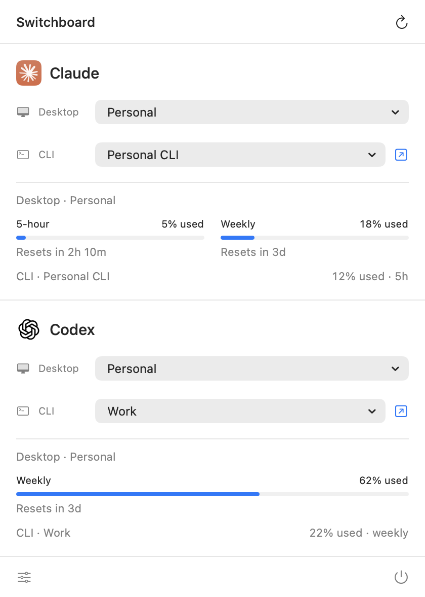

# Switchboard

Claude and Codex accounts, within reach. Switchboard is a native macOS menu bar app with separate Desktop and CLI account selectors and account-specific usage.



- Manage Claude and Codex accounts from the menu bar.
- Select Desktop and CLI identities separately, or share the Codex Desktop login with CLI.
- See Claude five-hour and weekly usage and Codex weekly usage.
- Manage saved accounts and API connections from Settings.

Switchboard is independent of Anthropic and OpenAI.

## Build

Install Apple's Command Line Tools and Rust 1.88 or newer:

```sh
git clone https://github.com/timomak/switchboard.git
cd switchboard
./macos/bundle.sh
```

The app and ZIP are written to `dist/`. The current bundle script sets `SwitchboardPreview=true`, which disables account-changing UI actions and global shortcuts. Building does not install or launch the app. Backend commands are described in the guides below.

For Developer ID signing and notarization, see [macOS distribution](docs/macos-distribution.md). Signing credentials belong in your local Keychain and are not included in this repository.

## Account behavior

Claude Desktop and CLI logins are independent. Codex CLI can share the Desktop home or use a separate authenticated home. Use the backend CLI launcher when commands should follow the selected CLI mode; an ordinary `codex` invocation follows its own environment.

Saved tasks can depend on a specific provider. Switchboard refuses changes that would remove or rebind a referenced provider. This can block returning to subscription after creating provider-bound tasks. See [provider compatibility](docs/codex-task-provider-compatibility.md) for details.

- [Desktop and CLI guide](docs/desktop-cli-switchboard.md)
- [Claude accounts](docs/claude-accounts.md)
- [Codex profiles](docs/codex-desktop-profiles.md)
- [API connections](docs/codex-cloud-providers.md)
- [Recovery](docs/switchboard-recovery.md)

## Privacy

Credentials stay in the existing local profile stores and Keychain locations. Some profile files, runtime configuration and recovery snapshots contain credentials; private file permissions are not encryption. Do not upload account stores, dotenv files, backups or raw diagnostics to issues. The README screenshot uses synthetic accounts.

## Checks

```sh
cargo fmt --all -- --check
cargo clippy --all-targets --locked -- -D warnings
cargo test --locked --lib codex_account::
cargo test --locked --lib codex_provider::
cargo test --locked --lib claude_connection::
./macos/run-tests.sh
```

With Gitleaks 8.28.0 installed, run `./scripts/scan-secrets.sh` and `./scripts/scan-secrets.sh --history`. CI checks source and history with redacted output.

## Credits and license

Switchboard is derived from [AI Usage Bar](https://github.com/akitaonrails/ai-usagebar) and retains its [MIT license](LICENSE). See [third-party notices](THIRD_PARTY_NOTICES.md) for upstream attribution, including Codex Account Switcher for Mac. Provider marks belong to their respective owners.

The `ai-usagebar` executable names and existing storage paths are retained for compatibility. Inherited Linux frontends remain in the source tree; this repository does not automatically publish their packages.
